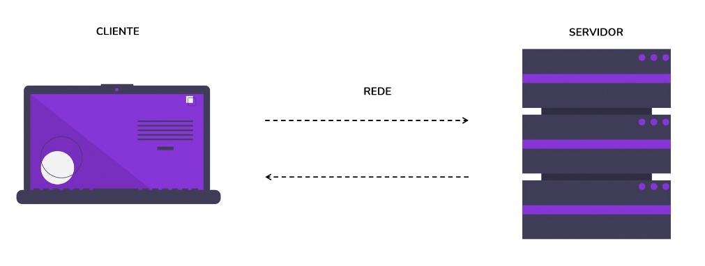
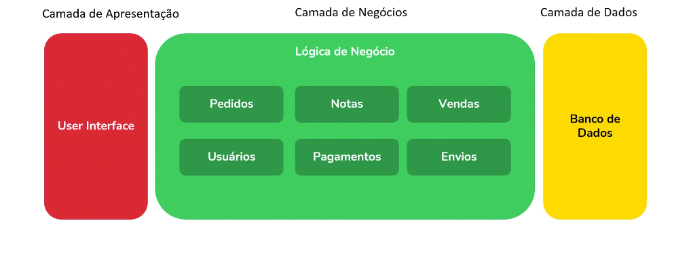
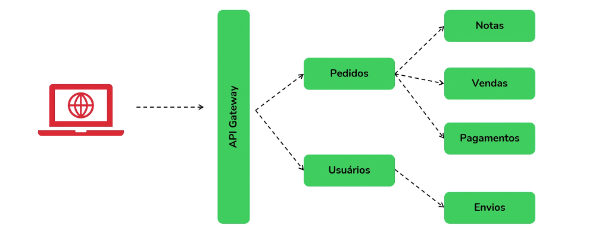
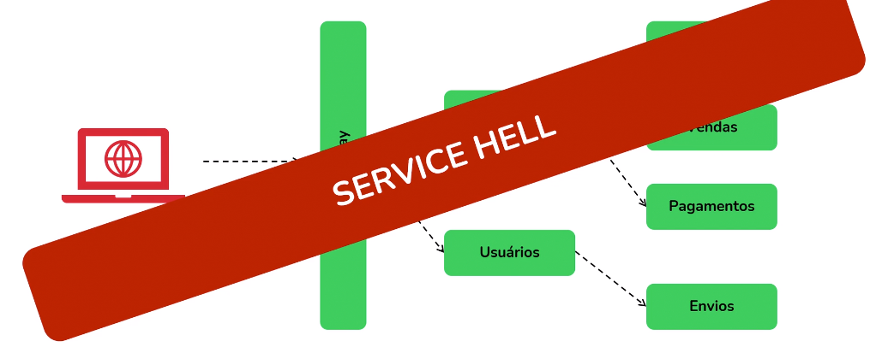
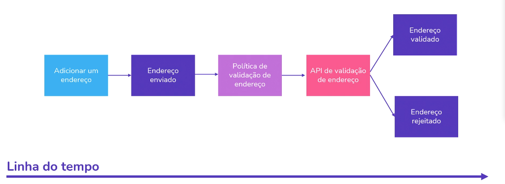
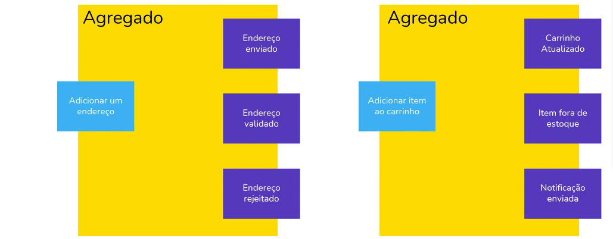
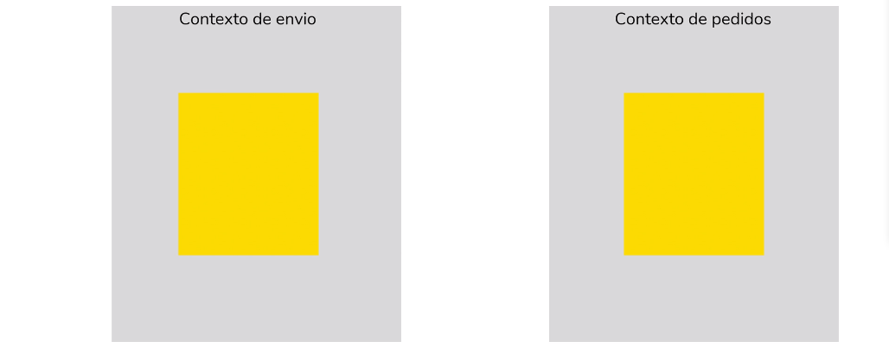
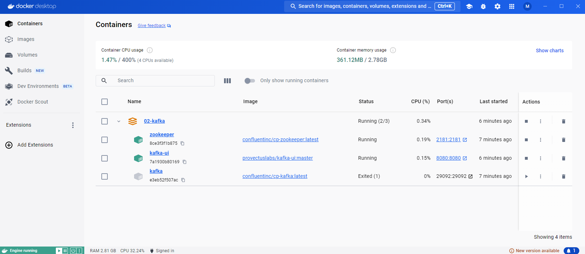

<h1>Fundamentos do Event-Driven Architecture</h1>

> O conteúdo também foi organizado nos **commits**

<!--#region Sumário -->

<!--#region Event-Driven Architecture -->

<details><summary>Event-Driven Architecture</summary>

<ul>
    <li><a href="#ed-1-01">Introdução</a></li>
    <li><a href="#ed-1-02">Cenário</a></li>
    <li><a href="#ed-1-03">Monolíticos, Microsserviços e EDA</a></li>
    <li><a href="#ed-1-04">EDA</a></li>
    <li><a href="#ed-1-05">EDA e Microsserviços</a></li>
    <li><a href="#ed-1-06">Messages, Events, Commands</a></li>
    <li><a href="#ed-1-07">Prós</a></li>
    <li><a href="#ed-1-08">Contras</a></li>
    <li><a href="#ed-1-09">Event Storming</a></li>
    <li><a href="#ed-1-10">Como funciona o Event Storming</a></li>
    <li><a href="#ed-1-11">Mapeamento de Eventos</a></li>
    <li><a href="#ed-1-12">Mapeando os Eventos de Endereço</a></li>
    <li><a href="#ed-1-13">Mapeando Contextos Delimitados</a></li>
    <li><a href="#ed-1-14">Demo - Shared Context</a></li>
    <li><a href="#ed-1-15">Demo - Contextos Delimitados e Domain Events</a></li>
</ul>

</details>

<!--#endregion -->

<!--#region Kafka e EDA -->

<details><summary>Kafka e EDA</summary>

<ul>
    <li><a href="#ed-2-01">Kafka</a></li>
    <li><a href="#ed-2-02">Broker</a></li>
    <li><a href="#ed-2-03">Zookeeper</a></li>
    <li><a href="#ed-2-04">Rodando Kafka via Docker</a></li>
    <li><a href="#ed-2-05">Cofluent Cloud</a></li>
    <li><a href="#ed-2-06">Tópicos</a></li>
    <li><a href="#ed-2-07">Demo - Procedure e Consume</a></li>
    <li><a href="#ed-2-08">Demo - Kafka e DDD</a></li>
</ul>

</details>

<!--#endregion -->

<!--#endregion -->

<!--#region Event-Driven Architecture -->

<h2>Event-Driven Architecture</h2>

<!--#region Introdução -->

<details id="ed-1-01"><summary>Introdução</summary>

<br/>

Arquitetura orientada a eventos

Objetivos:
- Entender sobre mensageria
- Microsserviços e eventos
- Arquitetura orientada a eventos
- Eventos como fonte de verdade

</details>

<!--#endregion -->

<!--#region Cenário -->

<details id="ed-1-02"><summary>Cenário</summary>

<br/>

O que a empresa faz?
- Produção
- Vendas
- Entregas

Esperado
- Mensagens, eventos e comandos
- Benefícios
- Drawbacks
- Event Storming
    - Dos eventos ao DDD
    
</details>

<!--#endregion -->

<!--#region Monolíticos, Microsserviços e EDA -->

<details id="ed-1-03"><summary>Monolíticos, Microsserviços e EDA</summary>

<br/>



### Monolíticos



- Escala, muda-se: tudo ou nada

### Microsserviços





**Ação compensatória**

</details>

<!--#endregion -->

<!--#region EDA -->

<details id="ed-1-04"><summary>EDA</summary>

<br/>

Event-Driven Architecture
- Arquitetura orientada a eventos
- Padrão de arquitetura
- Promove
    - Produção
    - Detecção
    - Consumo
    - Reação
- Tudo gira em torno de eventos, não de dados

Implementações:


</details>

<!--#endregion -->

<!--#region EDA e Microsserviços -->

<details id="ed-1-05"><summary>EDA e Microsserviços</summary>

<br/>

Cenário de microsserviços:
- Cada MS responde por um pipe de eventos
- Desacoplados
- Utilizando Brokers

</details>

<!--#endregion -->

<!--#region Messages, Events, Commands -->

<details id="ed-1-06"><summary>Messages, Events, Commands</summary>

<br/>

Mensagem:
- Unidade básica de comunicação
- Pode ser literalmente qualquer coisa
    - String, int, objeto

Evento:
- Uma mensagem que informa diversos "listeners" que algo aconteceu
- Quem publica o evento é chamado de "Producer"
- Quem ouve o evento é chamado de "Consumer"
    - Reagem ao evento
- Criamos evento sempre no passado
    - Order_Created
    - Account_Updated
- Já aconteceu, já foi disparado

Comando:
- Representa uma ação direcionada
- Possui uma conexão 1x1
    - Entre producer e consumer
- CriarConta, RealizarPedido

</details>

<!--#endregion -->

<!--#region Prós -->

<details id="ed-1-07"><summary>Prós</summary>

<br/>

Pontos positivos:
- Desacoplamento
    - Utilizam um Broker para se comunicar
        - Broker é um middleware que abstrai a comunicação entre os serviços
- Encapsulamento
    - Podemos trabalhar de forma independente atuando no contexto correto
- Performance
    - Quase em *real-time*
    - Escalável

</details>

<!--#endregion -->

<!--#region Contras -->

<details id="ed-1-08"><summary>Contras</summary>

<br/>

Pontos negativos:
- Curva de aprendizado
    - Como definir o SOT (Source of True)
    - E quando dá errado?
    - SAGAS (Sequência de Transações Locais)
- Complexo
    - Fluxos ficam complexos
    - Recortes nunca ficam corretos
- Não tem transação
- Versionamento
    - Mudanças nos objetos dos eventos

</details>

<!--#endregion -->

<!--#region Event Storming -->

<details id="ed-1-09"><summary>Event Storming</summary>

<br/>

DDD e Event Storming

- Modelo Tradicional
    - Centralizado em Dados
    - Normalmente feito por um DBA**

- EDA
    - Centralizado em Eventos
    - Combina bem com DDD
    - Feito através de um time
        - Evento chamado **Event Storming**

Event Storming

- Finalidade
    - Modelar o domínio com base em eventos
    - Resultado da colaboração de diversos membros

- Boas Práticas
    - Convide as pessoas certas
        - Facilitador, técnicos, arquitetos, negócio
    - Tenha um board com *post-its*

</details>

<!--#endregion -->

<!--#region Como funciona o Event Storming -->

<details id="ed-1-10"><summary>Como funciona o Event Storming</summary>

<br/>

Como funciona?

- Domain Event
    - Algo que acontece no sistema e é relevante para o negócio
    - Provoca reações
    - Outros eventos respondem a eles (ação compensatória)
- Policies
    - Ocorre após um evento ser disparado
    - "Sempre que"
        - Sempre que uma conta for criada, nós enviamos um e-mail
- Externo (External Systems)
    - Algo que acontece externo ao sistema
    - Não temos controle sobre
        - Pagamentos, envios de e-mails
- Commands (Comandos)
    - Iniciados pelo usuário ou outro sistema (job)
- Aggregate (Agregados)
    - Agrupam comportamentos em comum
- Bounded Context
    - Agrupam significados em comum

</details>

<!--#endregion -->

<!--#region Mapeamento de Eventos -->

<details id="ed-1-11"><summary>Mapeamento de Eventos</summary>

<br/>

DEMO


</details>

<!--#endregion -->

<!--#region Mapeando os Eventos de Endereço -->

<details id="ed-1-12"><summary>Mapeando os Eventos de Endereço</summary>

<br/>



> A API indica uma validação externa

</details>

<!--#endregion -->

<!--#region Mapeando Contextos Delimitados -->

<details id=""><summary>Mapeando Contextos Delimitados</summary>

<br/>

Mapeando agregados:



Mapeando contextos delimitados:



*De um lado o contexto de endereços*

</details>

<!--#endregion -->

<!--#region Demo - Shared Context -->

<details id="ed-1-14"><summary>Demo - Shared Context</summary>

<br/>

Os comandos são a porta de entrada.

</details>

<!--#endregion -->

<!--#region Demo - Contextos Delimitados e Domain Events-->

<details id=""><summary>Demo - Contextos Delimitados e Domain Events</summary>

<br/>


</details>

<!--#endregion -->

<!--#endregion -->

<!--#region Kafka e EDA -->

<h2>Kafka e EDA</h2>

<!--#region Kafka -->

<details id="ed-2-01"><summary>Kafka</summary>

<br/>

Apache Kafka

Por que escolher Kafka?
- Open source
- Criado no LinkedIn
- Apache License
- Netflix, Uber, Spotify
- Feito em Java
    - ByteCode => JVM
- High throughtput
    - Não tem serialização/ deserialização
    - Tudo binário
    - Zero Copy
- Distributed Streaming Platform
    - Mensagem, Storage, Processamento

</details>

<!--#endregion -->

<!--#region Broker -->

<details id="ed-2-02"><summary>Broker</summary>

<br/>

O que é?
- Recebe, armazena e transmite as mensagens
- Funciona em conjunto com o Zookeeper
- Deve ficar em um espaço dedicado
    - Servidor dedicado, recursos dedicados
- Tem um alto nível de I/O
    - Pode afetar todo o resto
- Processo que roda no topo do OS
- Basicamente armazena e lê mensagens
    - Tudo binário
- Provavelmente vai rodar em um cluster
    - Cluster = Conjunto de servidores

</details>

<!--#endregion -->

<!--#region Zookeeper -->

<details id="ed-2-03"><summary>Zookeeper</summary>

<br/>

O que é?
- Faz o "meio-campo" entre os brokers
- Funciona como um "load balancer"
- Gerencia falhas nos brokers

</details>

<!--#endregion -->

<!--#region Rodando Kafka via Docker -->

<details id="ed-2-04"><summary>Rodando Kafka via Docker</summary>

<br/>

```ps
cd .\02 - Kafka\
wsl
docker compose up -d
```

```ps
[+] Running 23/23
 ✔ kafka 2 layers [⣿⣿]                       0B/0B     Pulled                                            251.9s
   ✔ ad79ffd84e00 Pull complete                                                            143.5s
   ✔ 218229bf30d9 Pull complete                                                            140.5s
 ✔ kafka-ui 7 layers [⣿⣿⣿⣿⣿⣿⣿]             0B/0B     Pulled                                            159.0s
   ✔ 0ce1dd7918a4 Pull complete                                                             39.4s
   ✔ 396900a6066f Pull complete                                                             75.3s
   ✔ ea77a99f32d6 Pull complete                                                             76.7s
   ✔ d8a12b986814 Pull complete                                                             78.0s
   ✔ ac59f2acb415 Pull complete                                                             79.7s
   ✔ a5385df9cb3a Pull complete                                                             81.1s
   ✔ 91a81fafb194 Pull complete                                                            139.2s
 ✔ zookeeper 11 layers [⣿⣿⣿⣿⣿⣿⣿⣿⣿⣿⣿]      0B/0B     Pulled                                           252.0s
   ✔ fe36fc382320 Pull complete                                                             21.1s
   ✔ 4250354b4fb7 Pull complete                                                            142.6s
   ✔ c4c5f447179d Pull complete                                                              7.0s
   ✔ 17fe3a92262f Pull complete                                                              7.8s
   ✔ 5420596c14ab Pull complete                                                             28.8s
   ✔ 0e55377ebe37 Pull complete                                                             22.7s
   ✔ da7039bb2113 Pull complete                                                             25.5s
   ✔ d389b3791c2e Pull complete                                                             27.4s
   ✔ c24709eccb2a Pull complete                                                             29.1s
   ✔ 2f1cd7af357c Pull complete                                                             95.3s
   ✔ 03b1128dd5e0 Pull complete                                                             35.4s
[+] Running 3/4
 - Network 02-kafka_kafka-network  Created                                                                50.0s
 ✔ Container zookeeper             Started                                                  30.7s
 ✔ Container kafka                 Started                                                  34.1s
 ✔ Container kafka-ui              Started                                                  46.0s
```



http://localhost:8080/


</details>

<!--#endregion -->

<!--#region -->

<details id=""><summary></summary>

<br/>

</details>

<!--#endregion -->

<!--#endregion -->